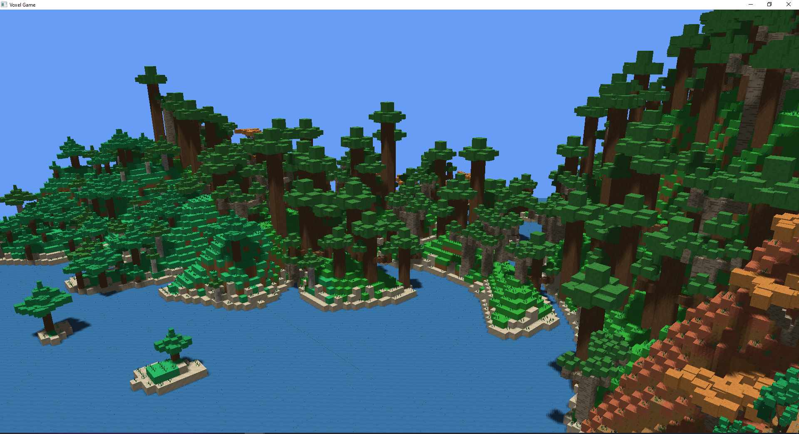

# Voxel Game rendering engine using OpenGL

## Controls
  - Fly around the world using `WSAD` and your mouse.
  - Zoom in by scrolling the mouse wheel.
  - Maximize the window by pressing `F`.
  - Pause the camera movement by pressing `P`.
  - Exit the game by pressing `ESC`.

You can export the scene by passing `-e` (`--export`) as an argument to the executable.

## Project structure

Includes for already compiled dependencies `/Dependencies`
  - GLAD
  - GLFW
  - GLFW_x64
  
Dependencies that are compiled are placed in `/VoxelGame/src/vendor`
  - glad
  - glm
  - stb_image
  - perlin_noise
  - simplex_noise
  
Game engine resources are placed in `/VoxelGame/res`
  - textures
  - shaders

## Building the app
The engine uses features from C++20. If you are using Visual studio, please update to version 16.7+.

For Visual studio there are prepared configurations for building the app:
  - Release x86 and x64. The preferred configuration for fast chunk generation.
  - Debug x86 and x64. 
  - Export x86. Just passes `--export` as an argument.
  - Test x86. Runs only tests.

## Issues
If you are running into issues with L-system parsing make sure you are using the proper file endings for your system.
Not using `CRLF` could cause problems on Windows. 
